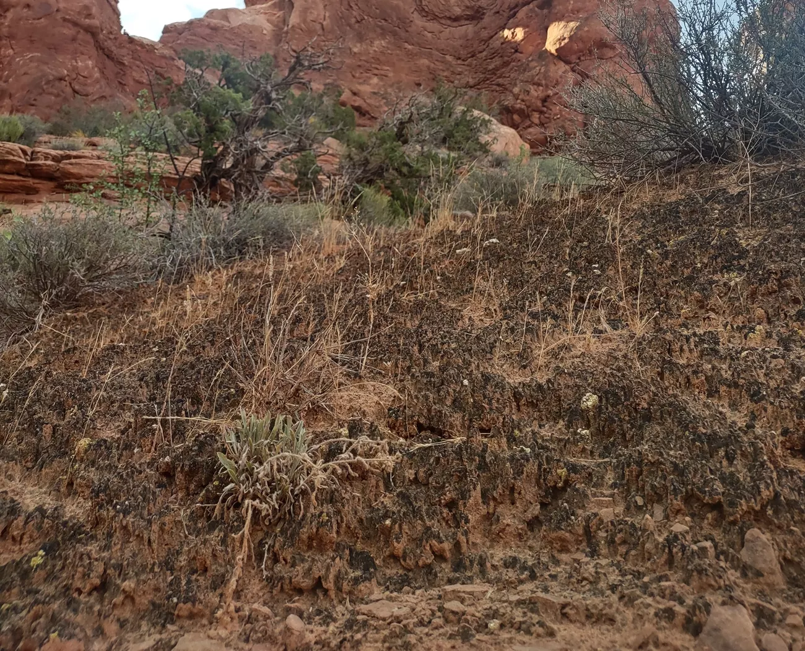

```{r setup, include=FALSE}
knitr::opts_chunk$set(echo = FALSE, warning = FALSE, message = FALSE)
source("scripts/R/shared.R")
```

## Overview and Project goals:

This is my final project for the Data Analysis for Biologists class (BIOL3100) at Utah Valley University. I am very lucky to be doing undergraduate research, so I had experience in bioinformatics and particularly in Phylogenomics. It would have been easy to take some of the research I was ready doing, reformat it, and present it as this final project. However, I decided to take the opportunity to push my skills. I decided to do a metagenomics project, something I have had no experience with. Along with that, I set some other goals

-   Learn Metageonmic analysis methods and tools.

-   Utalize R in more ways then for just visualization.

-   Use and learn new CLI tools for computational intensive sections.

-   Further refine how and when I use AI tools in my coding and research.

## Introduction: What lives within the sand

Metagenomics is word that doesn't come up in every day discussion. Metageomics can be defined as "is the study of the structure and function of entire nucleotide sequences isolated and analyzed from all the organisms (typically microbes) in a bulk sample. Metagenomics is often used to study a specific community of microorganisms, such as those residing on human skin, in the soil or in a water sample." ([NCBI](https://www.genome.gov/genetics-glossary/Metagenomics)). I knew I wanted to do a metagenomic study, but a study of what? I don't often wonder about what microbes are in soil, water of my gut, so what environment would I look at? The answer came to me not at the lab or at my computer, but in the deserts of southern Utah.

In arid environments, there is something called Cryptobiotic soil. Its a biocrust: a living net of microbes in the sand. I have been recreating in southern Utah and seen and interacted with Cryptobiotic soil all of my life. I knew what Cryptobiotic soil is, but what was it in? I knew then, starting at a crust, what I wanted to do a Metagenomic analysis of



Upon getting home from the desert, I went to work and began my research. I had heard many ranger tours (shout out to ranger rob, I'll never forget you) and signs about what Cryptobiotic soil was, but it was good to refresh.

Cryptobiotic soil is a biological soil crusts (biocrusts). These biocrusts are communities of living organisms that form matrix on the soil surface, binding soil particles together in a mat-like structure. They are found mostly in arid and semi-arid environments and are estimated to cover roughly 12% of Earth's land surface ([Rodriguez-Caballero et al., 2022](https://pmc.ncbi.nlm.nih.gov/articles/PMC9291340/)).

Cryptobiotic soil play a key ecological role in desert ecosystems. Microbes within them carry out key biological functions, including nitrogen and carbon fixation. They also influence the physical properties of the soil, affecting albedo (how reflective the surface is), surface stabilization, and water and nutrient retention. These crusts are also fragile can be easily damaged by grazing, fire, and human activity and take a long time to heal. I personally have seen patches of crust that have footprints in them, right next to trail. It can take a few years to several decades or longer to recover. Its recently been found that recovery of some of the algal and lichen components may take much longer, and could take **several hundred years** in very dry environments. Cryptobiotic soil is so important to the deserts that I love, I was now fired up to learn more about how what lives within.

## Getting Data and Getting very, very lucky

I had a target, but there was just one issue. I didn't have any Data. I also couldn't go out and collect the DNA from Cryptobiotic soil and sequence it, since the budget for this project was 0. All I had was my laptop, the internet, and a lot of ambition. I took a look inside of the NCBI's SRA database, a publicly available resource where people can upload and download raw reads from there projects. I began my search, and after some effort, found gold.

PacBio HiFi shotgun metagenomic reads from Cryptobiotic soil across multiple sites in the southwest.

This was a gold mine. Not only was there data, there was a lot of high-quality data! I skimmed through and decided to use six samples for my project. Two samples from Utah, Arizona, and New Mexico:

```{r, echo=FALSE, fig.width=10, fig.height=6}
library(ggrepel)
library(maps)

map_info <- meta_data %>%
  separate(lat_lon, into = c("lat", "lon"), sep = " N ") %>%
  mutate(
    lat = as.numeric(lat),
    lon = -parse_number(lon),
    sample = str_extract(title, "(?<=- ).*")
  ) %>%
  select(sample, lat, lon)

us_map <- map_data("state") %>%
  filter(region %in% c("utah", "arizona", "new mexico"))

ggplot() +
  geom_polygon(data = us_map, aes(x = long, y = lat, group = group),
               fill = "white", color = "black") +
  geom_point(data = map_info, aes(x = lon, y = lat), size = 2) +
  geom_text_repel(data = map_info, aes(x = lon, y = lat, label = sample),
                  size = 3, box.padding = .5) +
  theme_minimal()
```

The samples from Utah and Arizona were taken at the same sites respectively, while the New Mexico Samples were taken a different sites int the state. This lets us see how communities can differ at the same site while also seeing who the differ from site to site.

`rentrez`, an R package that makes interacting at scale with the NCBI databases easier, was used to collect all the metadata about the samples. I was then able to download the raw reads for each sample using `prefetch` and `fastq-fetch` in the `sra-tooklit`.

## Quality Control

Once the reads were downloaded, I used a CLI tool called Chopper to remove any poor quality reads. The reads had to be at least 1000bp's long and have a quality score of 20. Less than 500 reads were removed from reach sample, so we were working with very good data!

## What's living in the Crust?

### Who's There? (Community Composition)

The first thing I wanted to see is what kinds of bacteria are living in the Cryptobiotic soil. To do that, we are able to use a tool called Kraken2. Kraken2 maps the QC'd reads against a database of known bacterial and archeal reference sequences and gives out reads a likely taxonomic assignment.

I decided to look at are results at a phylum level, to understand an overall composition of the microbial community. I took the Kraken2 results of all samples and combined them into a master dataset

```{r, echo=TRUE}
master_kraken2_data <- list.files("data/reads/taxonomy/reports", full.names = TRUE) %>%
  map_dfr(function(f) {
    srr_num <- basename(gsub(".report", "", f))
    read_tsv(f, col_names = c("pct", "reads_clade", "reads_direct", "rank", "taxid", "name")) %>%
      mutate(srr = srr_num)
  }) %>%
  left_join(meta_data, by = "srr") %>%
  mutate(sample = str_extract(title, "(?<=- ).*"))
```

I then filtered the dataset to pull out the phylum rank and to only include organisms that were at least 1% present in the sample.

```{r, echo=TRUE}
phylum_data <- master_kraken2_data %>%
  filter(rank == "P", pct > 1) %>%
  select(sample, name, pct, geo_loc_name)
```

and finally, I created a bar chart to visualize the results.

```{r, echo=TRUE, fig.width=10, fig.height=6}
ggplot(phylum_data, aes(x = sample, y = pct, fill = fct_reorder(name, pct))) +
  geom_col() +
  facet_wrap(~ geo_loc_name, scales = "free_x") +
  scale_fill_viridis_d(option = "A", begin = 0.1, end = 0.85) +
  labs(
    title = "Desert Biocrust Community Composition",
    x = "Sample ID",
    y = "Relative Abundance (%)",
    fill = "Phylum"
  ) +
  theme_minimal(base_size = 14) +
  theme(
    plot.title = element_text(hjust = 0.5),
    legend.position = "bottom"
  ) +
  guides(fill = guide_legend(title = NULL, nrow = 2))
```

While each sample has a unique compositon of bacteria living within them, we do some some trends. At least 50% if the community is composed of both Pseudomonadota and Cyanobacteriota. We will look more into what these groups are doing later.

### How Diverse are they? (Alpha and Beta Diversity)

I could see that there was a lot of differences between the samples, but how much exactly? Was there a lot of diversity within the samples themselves? Two statical tools helped me answer that questions: Alpha and Beta diversity. The `vegan` package in R allows to at a look at this. Before we could do that I had to transform the data into something that Vegan could use. WE filtered things down to a species level and every species we included had to have at least 10 reads mapped to it. 

```{r, echo=TRUE}
species_count <- master_kraken2_data %>%
  filter(rank == "S", reads_direct > 10) %>% 
  select(geo_loc_name, sample, name, reads_direct)

vegan_species_data <- species_count %>%
  pivot_wider(names_from = name, values_from = reads_direct)

sample_info <- vegan_species_data %>%
  select(sample, geo_loc_name) %>%
  mutate(geo_loc_name = str_replace(geo_loc_name, "USA: ", ""))

vegan_matrix <- vegan_species_data %>%
  select(-sample, -geo_loc_name) %>%
  replace(is.na(.), 0)
```

#### Alpha Diversity

Alpha Diversity is a measurement of diversity within a single a sample. It asks two questions: How many different species are present and how evenly are they distributed? I used the shannon index to capture this, as it takes into account both factors. The higher the Shannon Value, the more diverse the Biocrust will be.

```{r, echo=TRUE, , fig.width=10, fig.height=6}
library(vegan)

sample_info$shannon <- diversity(vegan_matrix, index = "shannon")

# Alpha diversity plot
ggplot(sample_info, aes(x = sample, y = shannon, fill = geo_loc_name)) +
  geom_col() +
  facet_wrap(~ geo_loc_name, scales = "free_x") +
  scale_fill_viridis_d(option = "A", begin = 0.1, end = 0.85) +
  labs(
    title = "Desert Biocrust Community Alpha Diversity",
    x = "Sample ID",
    y = "Shannon Diversity",
    fill = "Location"
  ) +
  theme_minimal(base_size = 14) +
  theme(
    legend.position = "none",
    plot.title = element_text(hjust = 0.5)
  )

```

According to the Shannon index, The SON57 sample from far south arizona was the least diverse of the sites. Site SEV30 from central New Mexico, was our most diverse, with a Shannon score above 6. Shannon values for soil metagenomics typically fall between 4-7, so SEV30 has a very diverse community. There is a possible trend where samples from more southern, arid sites show lower diversity, though with only six samples this would need further testing to confirm. 

#### Beta Diversity

Beta Diversity is a measurement of the diversity between samples. Bray-Curtis dissimilarity was used for this analysis, which compares species composition between every pair of samples. PCoA (Principal Coordinates Analysis) was then used to plot the relationship in 2D space. The closer the points are on the plot, the more similar they are and vice versa.

```{r, echo=TRUE,  fig.width=10, fig.height=6}
pcoa_df <- vegdist(vegan_matrix, method = "bray") %>%
  cmdscale(k = 2) %>%
  data.frame(sample = sample_info$sample, geo_loc_name = sample_info$geo_loc_name)

ggplot(pcoa_df, aes(x = X1, y = X2, color = geo_loc_name)) +
  geom_point(size = 4) +
  geom_text(aes(label = sample), nudge_y = 0.03) +
  labs(
    title = "PCoA of Biocrust Communities",
    x = "PCoA Axis 1",
    y = "PCoA Axis 2",
    color = NULL
  ) +
  scale_color_viridis_d(option = "A", begin = 0.1, end = 0.85) +
  theme(
    legend.position = "bottom",
    plot.title = element_text(hjust = 0.5)
  ) +
  guides(color = guide_legend(title = NULL, nrow = 1))
```

The Utah samples (HS003, HSN023) and Arizona samples (SON57, SON60) each clustered tightly together, which makes sense — each pair was collected from the same site. The two New Mexico samples (CYAN3, SEV30) were more spread apart, reflecting the fact that they were collected from different locations within the state. CYAN3 in particular stands out as the most compositionally distinct sample, sitting far from all the others on the plot.

## From Reads to Genes

The reads where great at giving us a broad picture of what was living in the biocrust and the composition of the communities, but to understand in more detail whats going on, we need to go from reads to contigs.

Using the same QC'd reads that we feed in Kraken2, I gave them over to metaMDBG, an metageomic assemble program this is built for PacBio Hifi reads. It also has the benefit of being using very little memory. After having it run overnight we got out a total of 10,417 contigs from all samples!

These contigs ranged from small fragments to potential complete bacterial genomes. we used `prodigal`, a program that searches for potential proteins that could be coded by the contigs. We then pass those predicted proteins to `eggNOG-mapper`, which maps them to known protein families and then assigns them a broad functional group like "Energy production" or "Amino acid metabolism". These groups are called COG categories.
Pulling the data into R, I was able to to to calculate the proportion of the predicted proteins that mapped to which COG category within the samples. 

```{r, echo=TRUE}
eggnog_data <- list.files("data/assembly_COG/eggNOG-mapper_output",
                          pattern = "*.emapper.annotations",
                          recursive = TRUE, full.names = TRUE) %>%
  map_dfr(function(f) {
    srr <- basename(f) %>% gsub(".emapper.annotations", "", .)
    read_tsv(f, comment = "##") %>%
      mutate(srr = srr)
  }) %>%
  left_join(meta_data, by = "srr")

COG_data <- eggnog_data %>%
  mutate(sample = str_extract(title, "[^-]+$") %>% trimws(),
         geo_loc_name = gsub("USA: ", "", geo_loc_name)) %>%
  select(`#query`, COG_category, evalue, srr, sample, geo_loc_name) %>%
  filter_cog()

COG_proportions <- COG_data %>%
  count(sample, COG_description, geo_loc_name) %>%
  group_by(sample) %>%
  mutate(proportion = n / sum(n)) %>%
  ungroup() %>%
  mutate(sample = factor(sample, levels = c("CYAN3", "SON57", "HS003", "SEV30", "SON60", "HSN023")))
```

With the data cleaned and proportions calculated, we could plot it to see what all the mircobes in the biocrust were up too.

```{r, echo=TRUE,  fig.width=10, fig.height=6}

ggplot(COG_proportions, aes(x = reorder(COG_description, proportion), y = proportion, fill = sample)) +
  geom_col(position = "dodge") +
  coord_flip() +
  facet_wrap(~geo_loc_name, scales = "free_x") +
  scale_fill_viridis_d(option = "A", begin = 0.1, end = 0.85,
                       breaks = c("SON57", "SON60", "CYAN3", "SEV30", "HS003", "HSN023")) +
  labs(title = "Functional Profile of Desert Biocrust Metagenomes",
       x = "Predicted Gene Function", y = "Proportion", fill = "Sample") +
  theme(
    plot.title = element_text(size = 16, hjust = .5),
    axis.text = element_text(size = 12),
    axis.title = element_text(size = 14),
    plot.title.position = "plot"
  )

```

The functional profiles of the samples are all very similar to each other, showing that despite geographic distance and diversity, the Cryptobiotic soil all have the same underlying functions at play. These microbes live in some of the most extreme environments and must have the capability to survive. The most commonly appearing COG category is Amino Acid Metabolism. Resource availability in the environment is very limited, and being able to process what is there is crucial. One organism's waste is another's food source. Another category I think is interesting is Carbohydrate metabolism. This is the sugar economy of the biocrust. Cyanobacteria produce extracellular polysaccharides, the sticky sugars that physically bind soil particles together and form the "crust" in biocrust. Other organisms then break those sugars down for energy. So the very structure of the crust is built and maintained by the metabolic activity of the organisms living in it.


## Genes make Genomes

Like the reads, we filtered the contigs. Bacterial genomes are typically circular, so circular contigs are good candidates for complete genomes — but viruses can be circular too, so we needed to sort them out. Luckily, metaMDBG is able to identify circular contigs. Pulling them out and filtering for at least 5kb length and 3x coverage, we were left with 296 circular contigs. In order to find out if what I had were contigs or genomes, I used two tools — `geNomad` and `CheckM2`. geNomad was able to identify whether the circular contigs were bacterial chromosomes or viruses. Out of the 296, it classified 82 as chromosomes, 98 as proviruses, and 3 as whole viral contigs. The 82 chromosomes were then given to CheckM2 to verify they were actually complete and not chimeras of different genomes. 76 out of 82 passed with over 90% completeness and less than 5% contamination.

Now that I had some candidate genomes, I wanted to know what they were. Kraken2 was once again used to identify what the contigs were.

```{r, echo=TRUE, fig.width=12, fig.height=10}
contig_taxonomy <- read_tsv(
  "data/genomes/bacterial/taxonomy/contig_taxonomy.tsv",
  col_names = c("contig", "species", "taxid")
)

checkm2 <- read_tsv("data/genomes/bacterial/checkm2/output/quality_report.tsv")

genome_summary <- contig_taxonomy %>%
  left_join(checkm2, by = c("contig" = "Name")) %>%
  filter(Completeness > 90, Contamination < 5) %>%
  mutate(sample = str_extract(contig, "^SRR\\d+")) %>%
  left_join(meta_data, by = c("sample" = "srr")) %>%
  mutate(sample_name = str_extract(title, "(?<=- ).*"))

# Extract coverage from fasta headers
fasta_headers <- read_lines(pipe("grep '^>' data/genomes/bacterial/taxonomy/hq_chromosomes.fasta")) %>%
  keep(~ str_starts(.x, ">")) %>%
  tibble(header = .) %>%
  mutate(
    contig = str_extract(header, "(?<=>)\\S+"),
    coverage = as.numeric(str_extract(header, "(?<=coverage=)[\\d.]+"))
  ) %>%
  select(contig, coverage)

genome_summary <- genome_summary %>%
  left_join(fasta_headers, by = "contig")

genomes_within_sample <- genome_summary %>%
  select(sample, sample_name, species, geo_loc_name, coverage) %>%
  mutate(
    geo_loc_name = str_replace(geo_loc_name, "USA: ", ""),
    genus = str_extract(species, "^\\S+"),
    phylum = phylum_map[genus]
  )

species_order <- genomes_within_sample %>%
  distinct(species, phylum) %>%
  arrange(phylum, species) %>%
  pull(species)

genomes_within_sample <- genomes_within_sample %>%
  mutate(species = factor(species, levels = rev(species_order)))

ggplot(genomes_within_sample, aes(x = sample_name, y = species, color = phylum, size = coverage)) +
  geom_point() +
  scale_color_viridis_d(option = "A", begin = 0.1, end = 0.85) +
  facet_wrap(~ geo_loc_name, scales = "free_x") +
  theme_minimal(base_size = 14) +
  theme(
    axis.text.x = element_text(angle = 45, hjust = 1),
    axis.text.y = element_text(size = 10, color = "grey20"),
    strip.text = element_text(size = 12, face = "bold"),
    strip.background = element_rect(fill = "grey90", color = NA),
    panel.spacing = unit(1, "lines"),
    panel.grid.major.y = element_line(linewidth = 0.3),
    plot.title = element_text(hjust = 0.5),
    legend.text = element_text(size = 11),
    legend.title = element_text(size = 12)
  ) +
  labs(
    title = "Complete Genomes Recovered by Sample",
    x = "Sample",
    y = NULL,
    color = "Phylum"
  )
```
