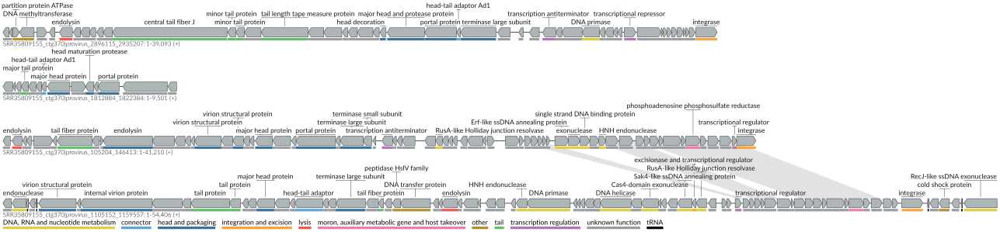

```{r setup, include=FALSE}
knitr::opts_chunk$set(echo = FALSE, warning = FALSE, message = FALSE)
library(tidyverse)
```

## Introduction

Biological soil crusts (biocrusts) are communities of living organisms that form matrix on the soil surface, binding soil particles together in a mat-like structure. They are found primarily in arid and semi-arid environments and are estimated to cover roughly 12% of Earth's land surface ([Rodriguez-Caballero et al., 2022](https://pmc.ncbi.nlm.nih.gov/articles/PMC9291340/)).

Biocrusts play a key ecological role in desert ecosystems. The organisms within them carry out key biological functions, including nitrogen and carbon fixation. They also influence the physical properties of the soil, affecting albedo, surface stabilization, and the retention of water and nutrients. These crusts, while playing such an important role, are also fragile can be easily damaged by grazing, fire, and human activity and take a long time to heal.

This project uses shotgun metagenomic sequencing to examine the bacterial, fungal, and viral communities of desert biocrusts across three sites in the American Southwest: Utah, New Mexico, and Arizona.

```{r sample-map, fig.width=8, fig.height=6}
library(maps)
library(ggrepel)

meta_data <- read.csv("data/metadata/biocrust_metadata.csv")

map_info <- meta_data %>%
  separate(lat_lon, into = c("lat", "lon"), sep = " N ") %>%
  mutate(
    lat = as.numeric(lat),
    lon = -parse_number(lon),
    sample = str_extract(title, "(?<=- ).*")
  ) %>%
  select(sample, lat, lon)

us_map <- map_data("state") %>%
  filter(region %in% c("utah", "arizona", "new mexico"))

ggplot() +
  geom_polygon(data = us_map, aes(x = long, y = lat, group = group),
                fill = "white", color = "black") +
  geom_point(data = map_info, aes(x = lon, y = lat), size = 4) +
  geom_text_repel(data = map_info, aes(x = lon, y = lat, label = sample),
                  size = 5, box.padding = .5) +
  theme_minimal()
```

## Data

I was ablr to find Six PacBio HiFi metagenome samples of biocrust from the NCBI Sequence Read Archive (SRA). I norrowed it down to that there were two samples per state: Utah (HS003, HSN023), New Mexico (CYAN3, SEV30), and Arizona (SON57, SON60). Sample metadata was retrieved using the `rentrez` R package to query the SRA and BioSample databases. Raw reads were downloaded using `prefetch` and `fastq-dump` from the SRA Toolkit.

```{bash, eval=FALSE, echo=TRUE}

```


After downloading all the Raw reads, they were filtered using `chopper` with a minimum quality score of 20 and a minimum read length of 1,000 bp. Less than 500 reads per sample were removed, so we have very high quality data.

```{bash, eval=FALSE, echo=TRUE}
# Stream decompress -> filter -> recompress
pigz -dc sample.fastq.gz | chopper -q 20 -l 1000 | pigz > sample_QC.fastq.gz
```

In order to find out what kind of organisms are living in the biocrust commuiniets, we used a program called Kraken2. Kraken2 takes the reads that we have and maps them against a database so we can identify them. For this analysis, we used the PlusPF-8 database, which includes bacterial, archaeal, viral, fungal, and protozoan reference sequences.

```{bash, eval=FALSE, echo=TRUE}
# Classify reads against PlusPF-8 database
kraken2 --db ~/databases/k2_pluspf_08gb \
    --threads 8 \
    --output sample.out \
    --report sample.report \
    sample_QC.fastq.gz
```

After getting the results back, we were able to look at them using R and plot what we found

```{r load-data, echo=TRUE}
# Read in metadata
meta_data <- read.csv("data/metadata/biocrust_metadata.csv")

# Read all Kraken2 reports into one data frame
master_kraken2_data <- list.files("data/kraken2/reports", full.names = TRUE) %>%
  map_dfr(function(f) {
    srr_num <- basename(gsub(".report", "", f))
    read_tsv(f, col_names = c("pct", "reads_clade", "reads_direct", "rank", "taxid", "name")) %>%
      mutate(name = str_trim(name), srr = srr_num)
  })

# Join with metadata and extract sample names
master_kraken2_data <- master_kraken2_data %>%
  left_join(meta_data, by = "srr") %>%
  mutate(sample = str_extract(.data$title, "(?<=- ).*"))
```

```{r phylum-barplot, echo=TRUE, fig.width=10, fig.height=6}
# Filter to phylum level, at least 1% abundance
phylum_data <- master_kraken2_data %>%
  filter(rank == "P", pct > 1) %>%
  select(sample, name, pct, geo_loc_name)

# Community composition barplot
ggplot(phylum_data, aes(x = sample, y = pct, fill = fct_reorder(name, pct))) +
  geom_col() +
  facet_wrap(~ geo_loc_name, scales = "free_x") +
  scale_fill_viridis_d(option = "A", begin = 0.1, end = 0.85) +
  labs(
    title = "Desert Biocrust Community Composition",
    x = "Sample ID",
    y = "Relative Abundance (%)",
    fill = NULL
  ) +
  theme_minimal(base_size = 14) +
  theme(legend.position = "bottom",
        plot.title = element_text(hjust = 0.5)) +
  guides(fill = guide_legend(nrow = 2))
```

## Diversity

To understand how diverse each community is and how they compare to each other, we calculated alpha and beta diversity metrics using the `vegan` package.

**Alpha diversity** measures the diversity *within* a single sample — how many different species are there and how evenly are they distributed? We used the Shannon diversity index, which accounts for both richness (number of species) and evenness (how balanced their abundances are). A higher Shannon index means a more diverse community.

```{r alpha-diversity, echo=TRUE, fig.width=10, fig.height=6}
library(vegan)

# Get species-level counts with a minimum of 10 reads
species_count <- master_kraken2_data %>%
  filter(rank == "S", reads_direct > 10) %>%
  select(geo_loc_name, sample, name, reads_direct)

# Pivot to species-by-sample matrix for vegan
vegan_species_data <- species_count %>%
  pivot_wider(names_from = name, values_from = reads_direct)

sample_info <- vegan_species_data %>%
  select(sample, geo_loc_name) %>%
  mutate(geo_loc_name = str_replace(geo_loc_name, "USA: ", ""))

vegan_matrix <- vegan_species_data %>%
  select(-sample, -geo_loc_name)
vegan_matrix[is.na(vegan_matrix)] <- 0

# Calculate Shannon diversity
sample_info$shannon <- diversity(vegan_matrix, index = "shannon")

# Plot alpha diversity
ggplot(sample_info, aes(x = sample, y = shannon, fill = geo_loc_name)) +
  geom_col() +
  facet_wrap(~ geo_loc_name, scales = "free_x") +
  scale_fill_viridis_d(option = "A", begin = 0.1, end = 0.85) +
  labs(
    title = "Desert Biocrust Community Alpha Diversity",
    x = "Sample ID",
    y = "Shannon Diversity"
  ) +
  theme_minimal(base_size = 14) +
  theme(legend.position = "none",
        plot.title = element_text(hjust = 0.5))
```

**Beta diversity** measures how different communities are *between* samples. We calculated Bray-Curtis dissimilarity and used PCoA (Principal Coordinates Analysis) to visualize the relationships. Samples that are closer together on the plot have more similar communities.

```{r beta-diversity, echo=TRUE, fig.width=8, fig.height=6}
# Calculate Bray-Curtis distance and run PCoA
bray_dist <- vegdist(vegan_matrix, method = "bray")
pcoa <- cmdscale(bray_dist, k = 2)

pcoa_df <- data.frame(
  pcoa,
  sample = sample_info$sample,
  geo_loc_name = sample_info$geo_loc_name
)

# Plot PCoA
ggplot(pcoa_df, aes(x = X1, y = X2, color = geo_loc_name)) +
  geom_point(size = 4) +
  geom_text(aes(label = sample), nudge_y = 0.03) +
  labs(
    title = "PCoA of Biocrust Communities",
    x = "PCoA Axis 1",
    y = "PCoA Axis 2",
    color = NULL) +
  scale_color_viridis_d(option = "A", begin = 0.1, end = 0.85) +
  theme(legend.position = "bottom",
        plot.title = element_text(hjust = 0.5)) +
  guides(color = guide_legend(title = NULL, nrow = 1))
```

## Assembly

With the QC'd reads in hand, we assembled each sample individually using metaMDBG, a Rust-based long-read metagenome assembler. It's designed specifically for HiFi reads and is incredibly memory-efficient — all six assemblies peaked at under 4.3 GB of RAM.

```{bash, eval=FALSE, echo=TRUE}
# Assemble each sample individually with metaMDBG
for file in data/reads/QC/*.fastq.gz; do
    base=$(basename "$file" _QC.fastq.gz)
    metaMDBG asm --out-dir "data/assemblies/$base" --in-hifi "$file" --threads 6
done
```

The assemblies came out looking great. N50 values ranged from 2.2 to 4.1 Mb, meaning half of the total assembly length is in contigs larger than that. For reference, a typical bacterial genome is 2-8 Mb, so many of our contigs are genome-scale. We also recovered between 8 and 26 circular contigs larger than 1 Mb per sample — these are likely complete bacterial chromosomes assembled end-to-end.

## Gene Annotation

To figure out what the organisms in our biocrusts are actually *doing*, we predicted genes on the assembled contigs using Prodigal in metagenomic mode, then annotated them with eggNOG-mapper.

Prodigal scans the contigs for open reading frames and predicts protein-coding genes. The `-p meta` flag tells it to use pre-built models for metagenomic data, since our contigs come from many different organisms with different codon usage patterns.

```{bash, eval=FALSE, echo=TRUE}
# Predict genes with Prodigal
pigz -dc contigs.fasta.gz | prodigal -p meta -i /dev/stdin \
    -a proteins.faa \
    -o genes.gff \
    -f gff
```

We then ran eggNOG-mapper on the predicted proteins, which uses DIAMOND to search against the eggNOG protein database and assigns functional annotations including COG categories, KEGG pathways, and protein family domains.

```{bash, eval=FALSE, echo=TRUE}
# Annotate predicted proteins with eggNOG-mapper
emapper.py -i proteins.faa \
    --output sample_name \
    --output_dir output/dir/ \
    --data_dir ~/databases/eggnog_db \
    -m diamond \
    --cpu 8
```

```{r cog-setup, echo=TRUE}
library(viridis)

# Read in all eggNOG annotation files
eggnog_data <- list.files("data/gene_annotation/eggNOG-mapper_output",
                          pattern = "*.emapper.annotations",
                          recursive = TRUE, full.names = TRUE) %>%
  map_dfr(function(f) {
    srr <- basename(f) %>% gsub(".emapper.annotations", "", .)
    read_tsv(f, comment = "##") %>%
      mutate(srr = srr)
  })

# Join with metadata
eggnog_data <- eggnog_data %>%
  left_join(meta_data, by = "srr")

# Filter, split multi-letter COG codes, and add descriptions
cog_names <- c(
  J = "Translation", A = "RNA processing", K = "Transcription",
  L = "Replication/repair", B = "Chromatin",
  D = "Cell cycle", V = "Defense", T = "Signal transduction",
  M = "Cell wall/membrane", N = "Cell motility", U = "Secretion/trafficking",
  O = "Protein turnover", W = "Extracellular", Z = "Cytoskeleton",
  C = "Energy production", G = "Carbohydrate metabolism",
  E = "Amino acid metabolism", F = "Nucleotide metabolism",
  H = "Coenzyme metabolism", I = "Lipid metabolism",
  P = "Inorganic ion transport", Q = "Secondary metabolites"
)

COG_data <- eggnog_data %>%
  mutate(sample = str_extract(.data$title, "(?<=- ).*"),
         geo_loc_name = gsub("USA: ", "", geo_loc_name)) %>%
  select(`#query`, COG_category, evalue, sample, geo_loc_name) %>%
  filter(evalue < 1e-5) %>%
  filter(COG_category != "-") %>%
  separate_longer_position(COG_category, width = 1) %>%
  filter(!COG_category %in% c("S", "R", "Y")) %>%
  mutate(COG_description = cog_names[COG_category])

# Normalize to proportions within each sample
COG_proportions <- COG_data %>%
  group_by(sample) %>%
  mutate(total = n()) %>%
  ungroup() %>%
  group_by(sample, COG_description, geo_loc_name) %>%
  summarize(proportion = n() / first(total), .groups = "drop")
```

```{r cog-plot, echo=TRUE, fig.width=12, fig.height=8}
ggplot(COG_proportions, aes(x = reorder(COG_description, proportion), y = proportion, fill = sample)) +
  geom_col(position = "dodge") +
  coord_flip() +
  facet_wrap(~geo_loc_name, scales = "free_x") +
  scale_fill_viridis_d(option = "A", begin = 0.1, end = 0.85) +
  labs(
    title = "Functional Profile of Desert Biocrust Metagenomes",
    x = "Predicted Gene Function",
    y = "Proportion",
    fill = "Sample") +
  theme(
    plot.title = element_text(size = 16, hjust = .5),
    axis.text = element_text(size = 12),
    axis.title = element_text(size = 14),
    plot.title.position = "plot"
  )
```

## Genome Classification

With complete assemblies in hand, we extracted all circular contigs (potential complete genomes) that were at least 5 kb long with at least 3x coverage. This gave us 296 circular contigs across the six samples.

We then used **geNomad** to classify each contig as a chromosome, plasmid, or virus. geNomad uses neural networks and marker gene enrichment to assign scores for each category. It also identifies proviruses — viral sequences integrated into bacterial chromosomes.

```{bash, eval=FALSE, echo=TRUE}
# Extract circular contigs >= 5kb and >= 3x coverage
pigz -dc contigs.fasta.gz \
    | rg "circular=yes" \
    | awk '{if(length >= 5000 && coverage >= 3) print}' \
    > circular_contigs.fasta

# Run geNomad to classify contigs
genomad end-to-end circular_contigs.fasta genomad_output ~/databases/genomad_db
```

geNomad classified our 296 circular contigs into three categories based on a score threshold of 0.9:

- **82 chromosomes** — likely complete bacterial genomes
- **172 plasmids** — extrachromosomal elements
- **98 proviruses** — integrated phages within larger contigs
- **3 whole viral contigs**

### Genome Quality Assessment

To verify that our chromosome contigs are actually complete bacterial genomes and not fragments or chimeras, we ran **CheckM2**. CheckM2 uses machine learning to predict genome completeness and contamination based on the presence of universal single-copy marker genes.

```{bash, eval=FALSE, echo=TRUE}
# Run CheckM2 on putative chromosomes
checkm2 predict --threads 6 -x .fasta \
    --database_path ~/databases/checkm2_db/CheckM2_database/uniref100.KO.1.dmnd \
    -i data/genome_classification/checkm2/input/ \
    -o data/genome_classification/checkm2/output/
```

**76 out of 82** passed high-quality thresholds (>90% completeness, <5% contamination), with most at 99-100% completeness and near-zero contamination. The 6 that didn't pass were small contigs (<500 kb) that lacked enough marker genes.

### Taxonomy of Complete Genomes

We ran **Kraken2** on the high-quality genomes to assign taxonomy. Since these are complete circular chromosomes rather than short reads, the classifications are highly confident — 100% of contigs were classified.

```{bash, eval=FALSE, echo=TRUE}
# Run Kraken2 on complete genomes
kraken2 --db ~/databases/k2_pluspf_08gb \
    --output hq_chromosomes.out \
    --report hq_chromosomes.report \
    hq_chromosomes.fasta
```

```{r contig-taxonomy, echo=TRUE, fig.width=10, fig.height=8}
library(viridis)

# Read contig taxonomy and CheckM2 quality
contig_taxonomy <- read_tsv(
  "data/genome_classification/kraken2/contig_taxonomy.tsv",
  col_names = c("contig", "species", "taxid")
)

checkm2 <- read_tsv("data/genome_classification/checkm2/output/quality_report.tsv")

# Join and filter to high quality
genome_summary <- contig_taxonomy %>%
  left_join(checkm2, by = c("contig" = "Name")) %>%
  filter(Completeness > 90, Contamination < 5)

# Plot species counts
species_counts <- genome_summary %>%
  count(species, sort = TRUE)

ggplot(species_counts, aes(x = reorder(species, n), y = n)) +
  geom_col(fill = viridis(1, option = "A", begin = 0.3)) +
  coord_flip() +
  labs(
    title = "Complete Circular Genomes Recovered",
    x = NULL,
    y = "Number of Genomes"
  ) +
  theme_minimal(base_size = 14) +
  theme(plot.title = element_text(hjust = 0.5))
```

The dominant taxa among our complete genomes include *Brevundimonas* (6 genomes), *Chitinophaga*, *Sediminibacterium*, and *Hydrogenophaga* — all commonly associated with arid soil environments. We also recovered complete genomes of biocrust keystone organisms including *Allocoleopsis franciscana* (a cyanobacterium) and *Nostoc* sp., both known nitrogen fixers in desert crusts.

### Genomes by Sample and Coverage

To understand which species were recovered from each sample and how abundant they were, we extracted coverage values from the assembly headers (a proxy for organism abundance) and mapped each species to its phylum.

```{r genome-dotplot, echo=TRUE, fig.width=12, fig.height=10}
# Extract coverage from fasta headers
fasta_headers <- read_lines(pipe("grep '^>' data/genome_classification/kraken2/hq_chromosomes.fasta")) %>%
  tibble(header = .) %>%
  mutate(
    contig = str_extract(header, "(?<=>)\\S+"),
    coverage = as.numeric(str_extract(header, "(?<=coverage=)[\\d.]+"))) %>%
  select(contig, coverage)

# Add coverage and sample info to genome summary
genome_summary <- genome_summary %>%
  left_join(fasta_headers, by = "contig") %>%
  mutate(sample = str_extract(contig, "^SRR\\d+")) %>%
  left_join(meta_data, by = c("sample" = "srr")) %>%
  mutate(sample_name = str_extract(title, "(?<=- ).*"))

# Map genus to phylum
phylum_map <- c(
  "Acidovorax" = "Pseudomonadota", "Allocoleopsis" = "Cyanobacteriota",
  "Altererythrobacter" = "Pseudomonadota", "Anatilimnocola" = "Planctomycetota",
  "Bosea" = "Pseudomonadota", "Bradyrhizobium" = "Pseudomonadota",
  "Brevundimonas" = "Pseudomonadota", "Candidatus" = "Pseudomonadota",
  "Chitinophaga" = "Bacteroidota", "Chryseolinea" = "Bacteroidota",
  "Devosia" = "Pseudomonadota", "Ferrovibrio" = "Pseudomonadota",
  "Ferruginibacter" = "Bacteroidota", "Flavisolibacter" = "Bacteroidota",
  "Flavobacterium" = "Bacteroidota", "Humisphaera" = "Planctomycetota",
  "Hydrogenophaga" = "Pseudomonadota", "Lysobacter" = "Pseudomonadota",
  "Mesorhizobium" = "Pseudomonadota", "Methyloversatilis" = "Pseudomonadota",
  "Miltoncostaea" = "Actinomycetota", "Nostoc" = "Cyanobacteriota",
  "Phreatobacter" = "Pseudomonadota", "Pseudoxanthomonas" = "Pseudomonadota",
  "Rhizobium" = "Pseudomonadota", "Rhodocytophaga" = "Bacteroidota",
  "Roseateles" = "Pseudomonadota", "Roseomonas" = "Pseudomonadota",
  "Sediminibacterium" = "Bacteroidota", "Sphingomonas" = "Pseudomonadota",
  "Sphingopyxis" = "Pseudomonadota", "Tellurirhabdus" = "Bacteroidota",
  "Terricaulis" = "Pseudomonadota", "Terrirubrum" = "Pseudomonadota",
  "unclassified" = "Pseudomonadota"
)

genomes_within_sample <- genome_summary %>%
  select(sample, sample_name, species, geo_loc_name, coverage) %>%
  mutate(
    geo_loc_name = str_replace(geo_loc_name, "USA: ", ""),
    genus = str_extract(species, "^\\S+"),
    phylum = phylum_map[genus]
  )

# Sort species by phylum then alphabetically
species_order <- genomes_within_sample %>%
  distinct(species, phylum) %>%
  arrange(phylum, species) %>%
  pull(species)

genomes_within_sample <- genomes_within_sample %>%
  mutate(species = factor(species, levels = rev(species_order)))

ggplot(genomes_within_sample, aes(x = sample_name, y = species, color = phylum, size = coverage)) +
  geom_point() +
  scale_color_viridis_d(option = "A", begin = 0.1, end = 0.85) +
  facet_wrap(~ geo_loc_name, scales = "free_x") +
  theme_minimal() +
  theme(
    axis.text.x = element_text(angle = 45, hjust = 1),
    axis.text.y = element_text(size = 10, color = "grey20"),
    strip.text = element_text(size = 12, face = "bold"),
    strip.background = element_rect(fill = "grey90", color = NA),
    panel.spacing = unit(1, "lines"),
    panel.grid.major.y = element_line(linewidth = 0.3),
    plot.title = element_text(hjust = 0.5),
    legend.text = element_text(size = 11),
    legend.title = element_text(size = 12)
  ) +
  labs(
    title = "Complete Genomes Recovered by Sample",
    x = "Sample",
    y = NULL,
    color = "Phylum"
  )
```

## Genome Annotation

### Brevundimonas sp. M20

*Brevundimonas* sp. M20 was the most frequently recovered genome, appearing in 5 of 6 biocrust samples. This complete ~3.5 Mb chromosome was annotated using [Bakta](https://github.com/oschwengers/bakta), identifying 3,580 CDS, 46 tRNAs, and 3 rRNAs. The circular genome map below shows CDS on both strands, GC content, and GC skew.

```{r bakta-circular, echo=FALSE, fig.cap="Circular genome map of Brevundimonas sp. M20 generated by Bakta."}
knitr::include_graphics("data/genome_classification/genomes/Brevundimonas_sp_M20/bakta/Brevundimonas_sp_M20.svg")
```

### Brevundimonas Proviruses

geNomad identified 4 integrated proviruses within the Brevundimonas sp. M20 chromosome. These were extracted and annotated with [Pharokka](https://github.com/gbouras13/pharokka), then visualized with [LoVis4u](https://github.com/art-egorov/lovis4u). All 4 proviruses showed no matches in the INPHARED database, suggesting they are novel phages. Homologous genes shared between the proviruses are shown with connecting links.



## Analysis Pipeline

```{mermaid}
flowchart TD
    A[Raw PacBio HiFi Reads] --> B[chopper - Read QC]
    B --> C[Kraken2 on Reads - Community Composition]
    B --> D[metaMDBG - Assembly]
    C --> C1[Alpha & Beta Diversity]
    D --> E[Prodigal - Gene Prediction]
    E --> F[eggNOG-mapper - Functional Annotation]
    D --> H[seqkit - Extract Circular Contigs]
    H --> I[geNomad - Classification]
    I --> J[Chromosomes]
    I --> K[Viruses]
    I --> L[Plasmids]
    J --> J1[CheckM2 - Quality Assessment]
    J1 --> J2[Kraken2 - Contig Taxonomy]
    J2 --> M[Bakta - Genome Annotation]
    J2 --> S[Taxonomy-Function Linkage]
    F --> S
    M --> N[LoVis4u / gggenes - Visualization]
    K --> O[CheckV - Quality Assessment]
    O --> P[Pharokka - Phage Annotation]
    L --> Q[Prodigal + eggNOG - Plasmid Functions]
    F --> R[COG Functional Profiles]
    P --> T[Visualize with gggenes / LoVis4u]
    Q --> T
    Q --> Q2[Plasmid vs Chromosome Function Comparison]
```

